# DQL Aged Equipment CBM
Aging-Aware Condition-Based Maintenance System using Deep Q-Learning

## 📋 Project Overview

This project implements a Condition-Based Maintenance (CBM) system that considers equipment aging (deterioration) using Deep Q-Learning (DQN).

### 🎯 Key Improvements

1. **3D State Space**: Multi-dimensional state representation with `(condition, temperature, normalized_age)`
2. **Installation Date Integration**: Incorporating equipment aging information into learning
3. **Aging Risk Model**: Dynamic degradation risk adjustment through aging_factor
4. **Multi-Equipment Support**: Comparative learning across different equipment types
5. **Comprehensive Visualization**: Multi-faceted results visualization including aging analysis

## 🏗️ System Architecture

### Aging-Aware CBM System Overview

```mermaid
flowchart TB
    subgraph DataInput["📊 Data Input"]
        A1["Equipment Specs CSV<br/>Measurement CSV<br/>Installation Date CSV"] --> A2["data_preprocessor.py"]
        A2 --> A3["Equipment Age Calculation<br/>(Current Date - Installation Date)"]
        A3 --> A4["Statistical Threshold Calculation<br/>Smin/Smax Estimation"]
        A4 --> A5["State Classification<br/>Normal/Anomalous"]
        A5 --> A6["Aging Analysis<br/>Age-Anomaly Rate Correlation"]
    end

    subgraph AgingModel["⏳ Aging Model"]
        B1["3D State Space<br/>(condition, temperature, age)"]
        B2["Aging Factor<br/>0.003-0.018"]
        B3["Age Normalization<br/>age/max_age"]
        B4["Dynamic Risk Adjustment<br/>transition_matrix x aging_factor"]
        B1 --> B2
        B2 --> B3
        B3 --> B4
    end

    subgraph Learning["🤖 Reinforcement Learning Engine"]
        C1["train_cbm_dqn_v2.py"]
        C2["QR-DQN + Aging Adaptation<br/>51 quantiles"]
        C3["Parallel Learning Environment<br/>16 AsyncVectorEnv"]
        C4["Progressive Learning Strategy<br/>• Fast: 200ep<br/>• Standard: 400ep<br/>• Long-term: 800ep<br/>• Special: 2000ep+"]
        C1 --> C2
        C2 --> C3
        C3 --> C4
    end

    subgraph Equipment["🏭 Equipment-Type Specific"]
        D1["AHU Equipment<br/>Differential Pressure"]
        D2["Pump Equipment<br/>Tank Level/Power"]
        D3["HVAC Equipment<br/>Temperature/Pressure"]
        D4["Individual aging_factor<br/>• AHU: 0.008+age x 0.0005<br/>• Pump: 0.005+age x 0.0003<br/>• Cooler: 0.015+age x 0.001"]
        D1 --> D4
        D2 --> D4
        D3 --> D4
    end

    subgraph Results["📈 Visualization"]
        E1["visualize_results.py"]
        E2["Learning Curves<br/>Aging Analysis<br/>Transition Matrix<br/>Policy Evaluation"]
        E3["compare_equipment_analysis.py"]
        E4["7-Equipment Comparison<br/>• Performance Ranking<br/>• Convergence Analysis<br/>• Age Correlation"]
        E1 --> E2
        E3 --> E4
    end

    subgraph Analysis["📊 Analysis Results"]
        F1["Equipment Performance Ranking<br/>1. AHU-TSK-A-2: +73.88<br/>2. Chemical Pump CP-500-5: +19.32<br/>3. OAC-TSK-F-2: +17.49<br/>..."]
        F2["Key Findings<br/>• Critical Importance of Learning Time<br/>• Anomaly Rate as Performance Determinant<br/>• Individual > Type Differences"]
        F3["Implementation Readiness<br/>• Level 1: Immediate (AHU)<br/>• Level 2: Monitored (4 units)<br/>• Level 3: Improvement Needed (1 unit)"]
        F1 --> F2
        F2 --> F3
    end

    subgraph Insights["💡 Validated Insights"]
        G1["AgedRL_Lesson.md<br/>README.md"]
        G2["7-Equipment Validated Findings<br/>• Age Correlation: +0.371<br/>• Data Quality is Critical<br/>• Equipment Type Myth Limitations"]
        G1 --> G2
    end

    A6 --> B1
    B4 --> C1
    C4 --> D4
    D4 --> E1
    E2 --> F1
    E4 --> F1
    F3 --> G1

    style DataInput fill:#e3f2fd
    style AgingModel fill:#fff3e0
    style Learning fill:#f3e5f5
    style Equipment fill:#e8f5e9
    style Results fill:#fce4ec
    style Analysis fill:#fff9c4
    style Insights fill:#e0f2f1
```



**System Features:**

1. **3D State Space**: Addition of equipment age to conventional 2D (condition, temperature)
2. **Dynamic Aging Model**: Degradation risk adjustment through aging_factor
3. **Equipment-Type Individualization**: Optimization according to AHU, Pump, HVAC characteristics
4. **Progressive Learning Strategy**: Optimal episode numbers according to equipment characteristics
5. **7-Equipment Validation Platform**: Comprehensive performance verification across diverse equipment

### Core Components

- **cbm_environment.py**: 3D state space-compatible CBM environment
- **data_preprocessor.py**: Installation date data integration processing
- **train_cbm_dqn_v2.py**: Aging-aware DQN learning engine
- **visualize_results.py**: Comprehensive results visualization system

### Data Files

```
data/private_benchmark/
├── # Equipment installation date data (205 units)
├── # Equipment specification data
└── # Measurement data samples
```

### Learning Results

Learning completed for 6 equipment units (2000 episodes each):

| Equipment Type | Equipment ID | Age (Years) | Final Performance | Improvement | Learning Results |
|----------------|--------------|-------------|------------------|-------------|------------------|
| Chemical Pump | 265715 | 19.7 | +19.32 | +9.02 | outputs_pump_265715 |
| Cooling Pump | 137953 | 3.0 | -3.07 | +55.33 | outputs_pump_137953 |
| Chemical Pump | 519177 | 0.5 | +11.34 | +56.54 | outputs_pump_519177 |
| AHU | 327240 | 15.6 | +73.88 | +2.53 | outputs_ahu_327240 |
| R-1-3 | 265694 | 19.7 | +13.93 | +298.83 | outputs_r13_265694 |
| OAC | 322220 | 17.7 | +17.49 | +7.19 | outputs_oac_322220 |

## 🧪 Experimental Results (7-Equipment Validation)


### 🚀 Critical Discoveries

1. **Importance of Learning Time**: Dramatic improvement with 2000 episodes (R-1-3: +298.83 improvement)
2. **Age Correlation Validation**: +0.371 positive correlation confirmed (older equipment shows higher performance)
3. **Universal Equipment Improvement**: 5 out of 6 equipment achieved implementation-ready levels
4. **Equipment Type-Specific Characteristics**: AHU excellence (+73.88), Pump stability, Power system challenges

### 📊 Implementation Readiness

- **Immediate Implementation**: AHU-TSK-A-2 (Performance +73.88, Stability 11.33)
- **Monitored Implementation**: 2 Chemical Pumps, OAC, R-1-3 (4 equipment units)
- **Continuous Improvement Needed**: Cooling Pump (Special challenges with power measurement items)

### ⏱️ Convergence Pattern Types

- **Fast Type (<200ep)**: Chemical Pump CP-500-3 (100ep convergence)
- **Standard Type (200-400ep)**: AHU, OAC, Chemical Pump CP-500-5 (Recommended range)
- **Long-term Type (>600ep)**: R-1-3 (768ep, overcoming high anomaly rates)

For detailed analysis results, see [AgedRL_Lesson.md](AgedRL_Lesson.md)

## 🚀 Usage

### Environment Setup

```bash
# Create and activate Python virtual environment
python -m venv .venv
.venv\Scripts\activate

# Install dependencies
pip install torch torchvision numpy pandas matplotlib seaborn pyyaml gym
```

### Single Equipment Learning

```bash
# Standard learning (recommended)
python train_cbm_dqn_v2.py --equipment_id 265715 --measurement_id 260374 --episodes 2000 --scenario balanced --aging_factor 0.018 --output_dir outputs_pump_265715

# Fast learning (for testing)
python train_cbm_dqn_v2.py --equipment_id 327240 --measurement_id 167473 --episodes 400 --scenario balanced --aging_factor 0.015 --output_dir outputs_test
```

### Batch Execution (6 Equipment Parallel)

```bash
# PowerShell
powershell -ExecutionPolicy Bypass -File run_6_equipment_training.ps1

# Batch file
run_6_equipment_training.bat
```

### Results Visualization

```bash
python visualize_results.py --output_dir outputs_pump_265715 --equipment_id 265715 --measurement_id 260374
```

## 📊 Parameter Explanation

### Aging Factor (aging_factor)

Adjusted according to equipment age and measurement items:

- **New Equipment (0-5 years)**: 0.003-0.005 (200ep recommended)
- **Mid-age (10-16 years)**: 0.015 (400ep recommended)
- **Aged (17+ years)**: 0.018 (800ep recommended)

### Recommended Learning Episodes

Equipment type-specific recommendations based on validation:

- **Fast Learning Type**: 200ep (New chemical pumps, etc.)
- **Standard Learning Type**: 400ep (AHU, OAC, etc., most common)
- **Long-term Learning Type**: 800ep (High anomaly rate equipment, R-1-3, etc.)
- **Special Challenge Type**: 2000ep+ (Power measurement items, etc.)

### Learning Scenarios

- **balanced**: Balanced maintenance strategy (recommended)
- **cost_efficient**: Cost-focused
- **safety_first**: Safety-focused

## 📈 Performance Metrics (7-Equipment)


### Learning Performance Ranking (7-Equipment Final Results)

1. **AHU-TSK-A-2** (15.6 years): +73.88 🏆 (Stability: 11.33)
2. **Chemical Pump CP-500-5** (19.7 years): +19.32 🥈 (Improvement: +9.02)
3. **OAC-TSK-F-2** (17.7 years): +17.49 🥉 (Improvement: +7.19)
4. **R-1-3** (19.7 years): +13.93 🚀 (Dramatic improvement: +298.83)
5. **Chemical Pump CP-500-3** (0.5 years): +11.34 ⚡ (Dramatic improvement: +56.54)
6. **Cooling Pump CDP-A5** (3.0 years): -3.07 ⚠️ (Major improvement: +55.33)

### Convergence Efficiency Ranking

1. **Chemical Pump CP-500-3**: 100ep ⚡ (Ultra-fast convergence)
2. **OAC-TSK-F-2**: 260ep 📈 (Fast convergence)
3. **Chemical Pump CP-500-5**: 303ep 📊 (Standard convergence)
4. **AHU-TSK-A-2**: 386ep 📊 (Standard convergence)
5. **R-1-3**: 768ep 🐌 (Long-term convergence, but ultimately successful)

### Visualization Output

Each learning result generates 4 types of plots:

1. **training_history.png**: Learning curves (rewards, loss)
2. **transition_matrix.png**: State transition matrix
3. **aging_analysis.png**: Aging analysis (age-anomaly rate correlation)
4. **policy_evaluation.png**: Policy evaluation (action distribution)

## 🔧 Customization

### Equipment List Generation

```bash
# Generate all equipment list
python generate_equipment_list.py

# Pump equipment specialized
python find_pumps.py
```

### Data Preprocessing

```bash
# Data preprocessing for specific equipment
python data_preprocessor.py --equipment_id 265715 --measurement_id 260374
```

## ⚠️ Important Notes

1. **Learning Time is Critical**: Dramatic improvement with sufficient episodes (1000ep→2000ep improved all equipment)
2. **Equipment Type-Specific Strategy**: Uniform parameters have limitations, individualization is important
3. **Convergence Determination**: Initial learning difficulties can be overcome through continuation (R-1-3 validation)
4. **Execution Time**: Approximately 20-30 minutes for 2000 episodes (varies by equipment)
5. **Memory Usage**: Approximately 2-3GB required during learning
6. **GPU Recommended**: CUDA-compatible GPU enables fast learning

## 📚 Related Documentation

- [AgedRL_Lesson.md](AgedRL_Lesson.md): Equipment age-specific maintenance strategy analysis
- [README_age.md](README_age.md): Technical details of aging functionality
- [README_v03_JP.md](README_v03_JP.md): Japanese version documentation
- [Scenario_Lessons.md](Scenario_Lessons.md): Scenario comparison analysis

## 🎯 Future Development (Validated Foundation)

### High Priority (Validated Effectiveness)
1. **Progressive Implementation**: AHU immediate implementation → 4 equipment monitored implementation
2. **Dynamic Learning Time Adjustment**: Application of optimal episode numbers by equipment type
3. **Individualized aging_factor**: Refinement based on validation data

### Medium Priority (Expected Improvement Effects)
4. **Hybrid Methods**: For special challenge equipment like power systems
5. **Transfer Learning**: Knowledge transfer from successful equipment (AHU)
6. **Real-time Adaptation**: Degradation prediction utilizing age correlation +0.371

### Long-term Consideration
7. **Multi-metric Learning**: Low priority as single-item improvements have been achieved for most equipment

---

**Created**: December 23, 2025  
**Target Equipment**: 6 units (Age 0.5-19.7 years)  
**Learning Completed**: All 6 units (2000 episodes each)  
**Validation Completed**: Dramatic improvement effects confirmed, implementation readiness evaluated  
**Analysis Completed**: Equipment age-specific maintenance strategy comparative analysis, convergence pattern establishment established
