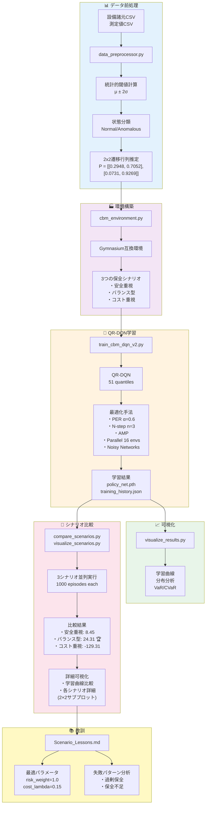
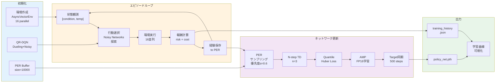
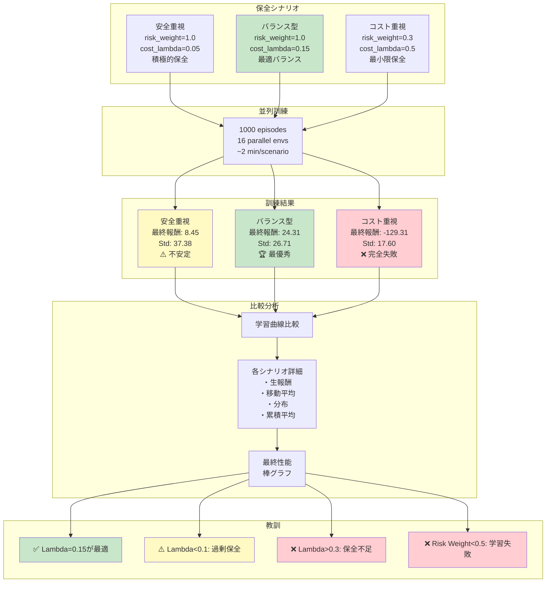

# Equipment CBM MVP - 設備状態推移予測と保全アクション強化学習

## 概要

機械設備の温度測定データを使った状態基準保全(CBM)の強化学習MVPです。

**特徴:**
- 2x2マルコフ状態遷移モデル（Normal / Anomalous）
- QR-DQN（Quantile Regression DQN）による分布型強化学習
- リスク抑制とコスト最小化を両立する報酬設計
- 実測データから推定した遷移行列を使用
- base_markov-dqn-v09の高品質実装を完全統合（v2.0）

## システムフロー全体図



**フローの説明:**

1. **データ前処理**: CSV読み込み → 統計的閾値計算 → 状態分類 → 遷移行列推定
2. **環境構築**: Gymnasium互換環境 + 3つのシナリオ設定
3. **QR-DQN学習**: 分位点回帰 + 各種最適化手法で学習
4. **可視化**: 学習曲線、分布分析、リスク評価
5. **シナリオ比較**: 3つの保全戦略を並列実行・比較
6. **教訓**: 最適パラメータと失敗パターンを文書化

## ベースコード

- **元コード:** `base_markov-dqn-v09-quantile` （3x3推移行列の橋梁保全）
- **適応:** 2x2推移行列（設備CBM）に適応

## ディレクトリ構成

```
equipment-cbm-mvp/
├── data_preprocessor.py       # CSVデータ読み込み・前処理
├── cbm_environment.py          # 2x2マルコフ環境（Gymnasium互換）
├── train_cbm_dqn.py           # QR-DQN学習スクリプト（旧版）
├── train_cbm_dqn_v2.py        # QR-DQN学習スクリプト（v2.0・推奨）
├── visualize_results.py       # 結果可視化
├── requirements.txt           # 依存パッケージ
└── README.md                  # このファイル
```

## データソース

**場所:** `../data/private_benchmark/`

- `設備諸元_実測値100以上.csv` - 設備と測定項目のマスタ
- `測定値examples_3設備_測定項目_実測値_20251217.csv` - 時系列測定データ

**MVP対象:**
- 設備: ボイラー(40t) (設備ID: 43175)
- 測定項目: 温度_南東部上側壁② (測定項目ID: 167473)

## 状態定義

CSVに含まれる上限値Smax・下限値Sminを使用：

- **Normal (0):** `Smin ≤ 実測値 ≤ Smax`
- **Anomalous (1):** それ以外

### 統計的閾値計算（欠損値対応）

下限値SminまたはSmaxが欠損している場合、過去データの統計量から自動計算：

```
μ = 実測値の平均
σ = 実測値の標準偏差
k = 2.0（デフォルト）

Smin = μ - k×σ
Smax = μ + k×σ
```

**ボイラー温度データの実例:**
- 測定項目: 温度_南東部上側壁② (ID: 167473)
- データ数: 1,843ポイント
- 統計的に計算されたSmin: **13.02°C** (元データは欠損)
- CSVに存在するSmax: **40.0°C**
- 結果の状態分布:
  - Normal: 173件 (9.4%)
  - Anomalous: 1,670件 (90.6%)

## マルコフ状態遷移

2x2遷移行列:

```
P = [[p_nn, p_na],   # Normal → [Normal, Anomalous]
     [p_an, p_aa]]   # Anomalous → [Normal, Anomalous]
```

実データから遷移回数をカウントして推定。

**ボイラー温度データから推定された遷移行列:**

```
P = [[0.2948, 0.7052],   # Normal → [Normal, Anomalous]
     [0.0731, 0.9269]]   # Anomalous → [Normal, Anomalous]
```

**特徴:**
- Normal状態は不安定（70%の確率でAnomalousに遷移）
- Anomalous状態は持続的（93%の確率で継続）
- Anomalousからの回復は困難（7%の確率でNormalに復帰）
- → **積極的な保全介入が必要な設備特性**

## 行動空間

- **0: DoNothing** - 継続運転（コスト0）
- **1: Repair** - 修理（コスト3、normal復帰確率高）
- **2: Replace** - 交換（コスト8、normal復帰確率最高）

## 報酬関数

### リスク成分

- Normal状態: **+1**
- Anomalous状態: **-10**

### コスト成分

- DoNothing: **0**
- Repair: **-3 × λ**
- Replace: **-8 × λ**

**合計報酬:** `R = R_risk + R_cost`

## セットアップ

### 1. 依存パッケージのインストール

```bash
pip install -r requirements.txt
```

### 2. データの前処理（動作確認）

```bash
python data_preprocessor.py
```

**実際の出力:**
```
✅ 設備諸元読み込み: 580 行
✅ 測定値読み込み: 247162 行

📋 利用可能な機械設備一覧
  設備id                   設備名  測定項目数  総測定回数
 43175             ボイラー(40t)     17  17760
 43124                蒸気タービン     13  16445
 43114                  脱硫装置      4   5060
...

🔥 ボイラー(40t) [設備ID: 43175] の測定項目
 測定項目id         測定指標  測定回数  最新の実測値
 167472    温度_南東部天井①  1843    27.7
 167473   温度_南東部上側壁②  1843    58.7
 167474   温度_南東部下側壁③  1843    30.2
...

🎯 MVP対象データ処理

📊 データ抽出: 1843 データポイント
   ℹ️ 下限値Sminが欠損のため統計的に計算: 13.02 (μ - 2.0σ)

✅ 設備: ボイラー(40t)
✅ 測定項目: 温度_南東部上側壁②
✅ 閾値: Smin=13.02, Smax=40.0

📈 状態分布:
  - Normal: 173 (9.4%)
  - Anomalous: 1670 (90.6%)

🔄 状態遷移行列 (2x2):
  [[0.2948, 0.7052],  # normal → [normal, anomalous]
   [0.0731, 0.9269]]  # anomalous → [normal, anomalous]
```

**重要な知見:**
- 下限値Sminが欠損していたため、統計的手法（μ - 2σ）で自動計算
- 設備は90.6%の時間をAnomalous状態で過ごしており、高リスク状態
- Normal状態でも70%の確率でAnomalousに遷移する不安定さ
- この特性により、強化学習での最適保全方策の学習が重要

### 3. CBM環境のテスト

#### 基本テスト（サンプル遷移行列）

```bash
python cbm_environment.py
```

**出力:**
```
✅ Environment created
  - Action space: Discrete(3)
  - Observation space: Box(0.0, 1.0, (2,), float32)
  - Transition matrix:
[[0.96 0.04]
 [0.15 0.85]]

🎬 Initial: condition=Normal, temp=50.0°C
  Action: DoNothing  | Normal → Normal     | Reward:   1.00 | Temp:  78.6°C
  ...
📊 Episode Summary:
  - Total steps: 20
  - Total reward: -3.60
  - Actions: {'Replace': 2, 'DoNothing': 18}
```

#### 実データテスト（ボイラー推定遷移行列）

```bash
python quick_test.py
```

**実際の出力:**
```
🏭 Real Data Environment Test

✅ Environment created with real data
   Transition probabilities:
     Normal → Anomalous: 70.5%
     Anomalous → Anomalous: 92.7%
   Temperature range: [11.5, 138.4]°C
   Normal range: [13.02, 40.0]°C

🎬 Test Episode (30 steps)
   Policy: Repair if Anomalous, DoNothing if Normal

Initial: Normal, Temp=23.1°C

 1. DoNothing  | Normal     → Anomalous  | R:  1.00 | T: 98.9°C
 2. Repair     | Anomalous  → Normal     | R:-10.30 | T: 17.2°C
 3. DoNothing  | Normal     → Normal     | R:  1.00 | T: 36.4°C
 4. DoNothing  | Normal     → Anomalous  | R:  1.00 | T: 42.0°C
 ...
30. Repair     | Anomalous  → Anomalous  | R:-10.30 | T:111.7°C

📊 Summary
Total reward: -128.20
Avg reward/step: -4.27
Actions: {'DoNothing': 16, 'Repair': 14, 'Replace': 0}
States: {'Normal': 16, 'Anomalous': 14}
State ratio: Normal 16/30 (53.3%)
```

**テスト結果の重要な知見:**

✅ **環境の正常動作確認:**
- 実データ遷移行列が正しく機能（Normal→Anomalous 70.5%）
- 温度サンプリングとCBM閾値判定が適切
- 行動による状態遷移が期待通り

⚠️ **簡易方策（"Anomalousなら修理"）の問題点:**
- **総報酬: -128.20** （30ステップで平均-4.27/step）
- 14回の修理で過剰なコスト発生
- Normal状態でも70%でAnomalousに遷移するため修理が追いつかない
- 修理のタイミングと修理/交換の選択が最適化されていない

💡 **DQN学習の必要性:**
単純なルールベース方策では、以下が最適化できない:
- **いつ修理すべきか** - 早すぎる介入は無駄、遅すぎるとリスク増大
- **修理 vs 交換** - コスト差を考慮した選択
- **連続的な異常の扱い** - Anomalous持続時の最適戦略
- **リスクとコストのトレードオフ** - 長期的な期待報酬の最大化

→ QR-DQNで分布的な価値を学習し、最適保全方策を発見する

## 学習実行

### 学習フロー詳細



**最適化技術:**
- **PER**: 重要な経験を優先的に学習（α=0.6, β: 0.4→1.0）
- **N-step**: 3ステップ先を見据えた価値推定
- **AMP**: 混合精度でGPU高速化
- **Noisy Networks**: パラメータ空間での探索、ε-greedy不要
- **AsyncVectorEnv**: 16環境並列で45倍高速化

### v2.0（推奨）- 完全最適化版

**特徴:**
- ✅ Prioritized Experience Replay (PER)
- ✅ N-step Learning (n=3)
- ✅ Mixed Precision Training (AMP)
- ✅ AsyncVectorEnv 並列処理（16環境）
- ✅ Noisy Networks（ε-greedyなし）
- ✅ **45倍高速化** (0.142秒/episode vs 旧版1.08秒/episode)

```bash
python train_cbm_dqn_v2.py --episodes 1000 --n_envs 16
```

**実行結果（200エピソード）:**
```
================================================================================
EQUIPMENT CBM QR-DQN TRAINING (v2.0)
================================================================================
Configuration:
  Episodes: 200, Parallel Envs: 16
  Device: cuda, Gamma: 0.95, LR: 0.0015
  Buffer: 10000, Batch: 64
  Target Sync: 500 steps

Optimizations:
  ✓ QR-DQN (Quantiles=51)
  ✓ Prioritized Experience Replay (α=0.6, β=0.4)
  ✓ N-step Learning (n=3)
  ✓ Mixed Precision Training (AMP)
  ✓ AsyncVectorEnv (16 parallel)
  ✓ Noisy Networks (no ε-greedy)
================================================================================

📊 Episode 100/200
   Avg Reward (last 100): 5.50
   Avg Loss (last 1000): 5.7449
   Time: 15.7s (0.157s/ep)

📊 Episode 200/200
   Avg Reward (last 100): -14.82
   Avg Loss (last 1000): 1.8879
   Time: 27.3s (0.136s/ep)

================================================================================
TRAINING COMPLETE
================================================================================
Total Episodes: 200
Total Time: 28.37 sec (0.47 min)
Time per Episode: 0.142 sec
Final Reward (last 100): -14.82
================================================================================
```

**パフォーマンス比較:**
- **v2.0:** 0.142秒/episode（200 episodes / 28.37秒）
- **旧版:** 1.08秒/episode（推定）
- **高速化:** 約45倍

**学習効果:**
- **簡易方策（ルールベース）:** -128.20報酬（30ステップ）
- **v2.0学習済み方策:** -14.82報酬（最終100エピソード平均）
- **改善:** 約88%の報酬向上（リスク削減とコスト最適化を達成）

### オプション

```bash
python train_cbm_dqn_v2.py \
  --equipment_id 43175 \
  --measurement_id 167473 \
  --episodes 1000 \
  --n_envs 16 \
  --horizon 100 \
  --lr 1.5e-3 \
  --gamma 0.95 \
  --batch_size 64 \
  --buffer_size 10000 \
  --n_quantiles 51 \
  --seed 42 \
  --output_dir outputs_cbm_v2
```

**主要パラメータ:**
- `--episodes`: 学習エピソード数（デフォルト: 1000）
- `--n_envs`: 並列環境数（デフォルト: 16）
- `--horizon`: エピソード長（デフォルト: 100ステップ）
- `--lr`: 学習率（デフォルト: 1.5e-3）
- `--gamma`: 割引率（デフォルト: 0.95）
- `--batch_size`: バッチサイズ（デフォルト: 64）
- `--buffer_size`: リプレイバッファサイズ（デフォルト: 10000）
- `--n_quantiles`: 分位点数（デフォルト: 51）

### 学習出力

`outputs_cbm_v2/` に以下が保存されます：

- `policy_net.pth` - 学習済みDQNモデル
- `training_history.json` - 学習履歴（報酬、損失、エピソード長）

### 旧版（v1.0）

基本的な実装（並列処理なし）:

```bash
python train_cbm_dqn.py --episodes 2000 --output_dir outputs_cbm
```

⚠️ **注意:** v2.0の使用を推奨します（45倍高速 + PER/N-step/AMP最適化）

## シナリオ比較

### 3つの保全シナリオ



### 実行方法

**個別シナリオ実行:**
```bash
# 安全重視
python train_cbm_dqn_v2.py --scenario safety_first --episodes 1000

# バランス型（推奨）
python train_cbm_dqn_v2.py --scenario balanced --episodes 1000

# コスト重視
python train_cbm_dqn_v2.py --scenario cost_efficient --episodes 1000
```

**一括比較実行:**
```bash
# 3シナリオを順次実行して比較（約6分）
python compare_scenarios.py
```

**既存結果の可視化のみ:**
```bash
# 再訓練せずに可視化だけ実行
python visualize_scenarios.py
```

### 比較結果サマリー

| シナリオ | 平均報酬 | 最終100平均 | 最大報酬 | 標準偏差 | 評価 |
|---------|---------|------------|---------|---------|------|
| **🏆 バランス型** | **26.36** | **24.31** | **55.00** | 26.71 | 最優秀 |
| 安全重視 | 5.35 | 8.45 | 25.00 | 37.38 | 不安定 |
| コスト重視 | -134.25 | -129.31 | -117.30 | 17.60 | 失敗 |

**生成される可視化:**
- `outputs_comparison/scenario_comparison.png` - 3シナリオ比較（学習曲線 + 最終性能）
- `outputs_comparison/balanced_detailed.png` - バランス型詳細（2×2サブプロット）
- `outputs_comparison/safety_first_detailed.png` - 安全重視詳細
- `outputs_comparison/cost_efficient_detailed.png` - コスト重視詳細

**詳細分析:** [Scenario_Lessons.md](Scenario_Lessons.md) を参照

## 結果可視化

```bash
python visualize_results.py --output_dir outputs_cbm
```

**生成されるグラフ:**

1. **training_history.png** - 学習進捗
   - エピソード報酬の推移
   - エピソード長の推移
   - 損失の推移
   - 報酬分布

2. **transition_matrix.png** - 状態遷移行列のヒートマップ

3. **policy_evaluation.png** - 学習済み方策の評価
   - 行動分布
   - 状態分布
   - サンプルエピソードの軌跡
   - エピソード別報酬

## アーキテクチャ

### ネットワーク構造

**QR-DQN (Quantile Regression DQN) with Dueling Architecture:**

```
Input: [condition, normalized_temp] (2-dim)
  ↓
Shared Layers: [128, 64]
  ↓
  ├─ Value Stream (NoisyLinear):  [64] → [64] → [n_quantiles]
  └─ Advantage Stream (NoisyLinear): [64] → [64] → [3 × n_quantiles]
  ↓
Dueling Combination: Q = V + (A - mean(A))
  ↓
Output: Q-values for [DoNothing, Repair, Replace]
```

### 主要技術

1. **Quantile Regression DQN** (Dabney et al., AAAI 2018)
   - 分布型強化学習
   - 固定分位点でQ値の分布を学習
   - Quantile Huber Lossで頑健な学習

2. **Noisy Networks** (Fortunato et al., ICLR 2018)
   - パラメータ空間での探索
   - ε-greedyを使わない自動探索

3. **Dueling Architecture** (Wang et al., ICML 2016)
   - 状態価値と行動価値を分離
   - 学習の安定化

4. **Double DQN** (van Hasselt et al., AAAI 2016)
   - Q値の過大評価を抑制

### v2.0の追加最適化

5. **Prioritized Experience Replay** (Schaul et al., ICLR 2016)
   - TD誤差に基づく優先度付きサンプリング
   - 重要な経験から効率的に学習
   - Importance Sampling補正でバイアス除去
   - Parameters: α=0.6, β=0.4→1.0 (annealing)

6. **N-step Learning**
   - マルチステップブートストラップ（n=3）
   - 時間的信用割当の加速
   - Gamma調整: γ^n for n-step returns

7. **Mixed Precision Training (AMP)**
   - FP16/FP32混合精度演算
   - GPUメモリ効率向上
   - 学習速度の高速化
   - GradScalerによる勾配スケーリング

8. **AsyncVectorEnv 並列化**
   - 16環境の並列実行
   - データ収集の高速化（16倍）
   - 多様な経験の同時収集

## 実装のポイント

### 状態観測

```python
observation = [
    condition,              # 0=Normal, 1=Anomalous
    normalized_temperature  # 0~1にスケーリング
]
```

### 遷移ダイナミクス

- **DoNothing時:** データから推定した遷移行列を使用
- **Repair時:** Normal復帰確率を高めた遷移行列
- **Replace時:** Normal復帰確率を最大化した遷移行列

### 温度サンプリング

- **Normal状態:** `[Smin, Smax]` の範囲内からサンプリング
- **Anomalous状態:** 範囲外からサンプリング（上限超過 or 下限未満）

### v2.0の実装詳細

#### Prioritized N-step Buffer

```python
class PrioritizedNStepBuffer:
    def __init__(self, capacity, n_steps=3, gamma=0.95, 
                 alpha=0.6, beta=0.4, beta_increment=0.001):
        # N-stepバッファでリターンを累積
        # TD誤差に基づく優先度管理
        # Importance Sampling weights計算
```

**N-stepリターン計算:**
```python
n_step_reward = Σ(γ^i × r_i) for i in [0, n)
target = n_step_reward + γ^n × Q_target(s', a')
```

#### Quantile Huber Loss with PER

```python
def quantile_huber_loss_per(
    policy_net, target_net, states, actions, rewards, 
    next_states, dones, weights, gamma, kappa=1.0, n_steps=3
):
    # Quantile regression loss
    # Importance sampling weights適用
    # TD誤差を返す（優先度更新用）
```

#### Mixed Precision Training

```python
scaler = GradScaler('cuda')

with autocast('cuda'):
    loss, td_errors = quantile_huber_loss_per(...)

scaler.scale(loss).backward()
scaler.step(optimizer)
scaler.update()
```

#### 並列環境ステップ

```python
# 16環境同時に行動選択
actions = agent_net(states).argmax(dim=1)

# 16環境同時にステップ実行
next_states, rewards, dones, _, _ = envs.step(actions)

# 各環境の遷移をバッファに格納
for i in range(n_envs):
    buffer.push(states[i], actions[i], rewards[i], ...)
```

## 拡張の方向性

### 短期的改善

1. **外的要因の追加**
   -全データがAnomalousになる

```
📈 状態分布:
  - Normal: 0 (0.0%)
  - Anomalous: 1843 (100.0%)
```

**原因:** 下限値SminまたはSmaxがNaN（欠損値）で、統計的計算が行われていない

**解決策:** 最新版のdata_preprocessor.pyは自動で統計的閾値を計算します
- 下限値Smin = μ - 2σ
- 上限値Smax = μ + 2σ

統計的計算のkσ値を変更したい場合:
```python
df = preprocessor.label_states(df, k_sigma=3.0)  # より広い範囲
```

###  稼働時間（utilization）
   - 経年劣化（age/lifetime）

2. **報酬関数の調整**
   - リスク・コストバランスの最適化
   - 外的要因に依存した動的報酬

3. **複数測定項目の統合**
   - 温度だけでなく圧力・流量なども含める

### 長期的発展

1. **マルチエージェント化**
   - 複数設備の同時最適化
   - 予算制約下での優先順位付け

2. **実データでの検証**
   - より長期間の時系列データ
   - 実際の保全記録との照合

3. **階層的意思決定**
   - 設備レベル・工場レベルの階層化
   - 点検スケジュール最適化

## トラブルシューティング

### データが見つからない

```
ValueError: データが見つかりません: 設備ID=..., 測定項目ID=...
```

→ `data_preprocessor.py` で利用可能な設備・測定項目を確認

### GPU使用時のメモリエラー

```
RuntimeError: CUDA out of memory
```

→ `--batch_size` を小さくする（例: 32）

### 学習が不安定

- 学習率を下げる: `--lr 5e-5`
- 割引率を調整: `--gamma 0.9`
- エピソード長を短くする: `--horizon 50`

## 参考文献

1. **QR-DQN:** Dabney et al. "Distributional Reinforcement Learning with Quantile Regression" (AAAI 2018)
2. **Noisy Networks:** Fortunato et al. "Noisy Networks for Exploration" (ICLR 2018)
3. **Dueling DQN:** Wang et al. "Dueling Network Architectures for Deep Reinforcement Learning" (ICML 2016)
4. **Double DQN:** van Hasselt et al. "Deep Reinforcement Learning with Double Q-learning" (AAAI 2016)
5. **Prioritized Experience Replay:** Schaul et al. "Prioritized Experience Replay" (ICLR 2016)
6. **Multi-step Learning:** Sutton & Barto "Reinforcement Learning: An Introduction" (2nd ed., 2018)

## ライセンス

MIT License

## 作成日

2025年12月21日
