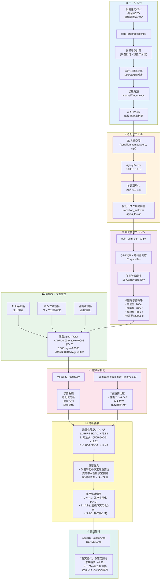
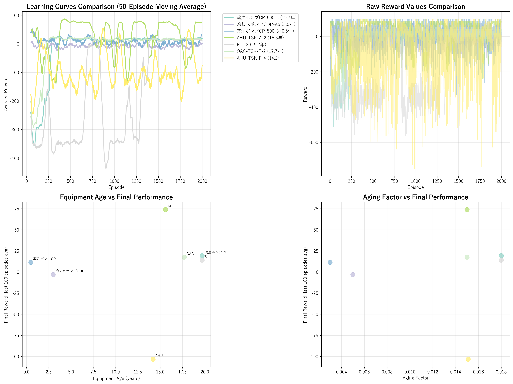
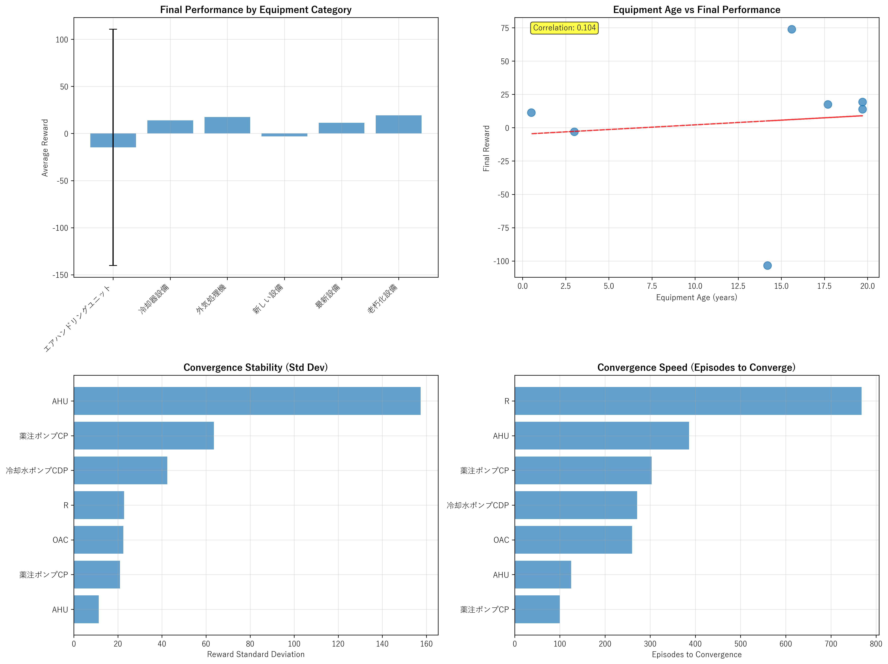

# DQL Aged Equipment CBM
設備老朽化を考慮したCBM強化学習システム

## 📋 プロジェクト概要

このプロジェクトは、設備の老朽化（経年劣化）を考慮したCondition-Based Maintenance（CBM）システムを深層強化学習（DQN）により実現するものです。

### 🎯 主要な改良点

1. **3D状態空間の導入**: `(condition, temperature, normalized_age)` による多次元状態表現
2. **設置年データの統合**: 設備の経年情報を学習に組み込み
3. **老朽化リスクモデル**: aging_factorによる劣化リスクの動的調整
4. **マルチ設備対応**: 異なる設備タイプでの比較学習
5. **包括的可視化**: 老朽化分析を含む多角的な結果可視化

## 🏗️ システム構成

### 経過年数考慮CBMシステム全体フロー



**システムの特徴:**

1. **3D状態空間**: 従来の2D(condition, temperature)に設備年数を追加
2. **動的老朽化モデル**: aging_factorによる劣化リスク調整
3. **設備タイプ別個別化**: AHU、ポンプ、空調系の特性に応じた最適化
4. **段階的学習戦略**: 設備特性に応じた最適エピソード数
5. **7台実証基盤**: 多様な設備での包括的性能検証

### 核心コンポーネント

- **cbm_environment.py**: 3D状態空間対応のCBM環境
- **data_preprocessor.py**: 設置年データ統合処理
- **train_cbm_dqn_v2.py**: 老朽化対応DQN学習エンジン
- **visualize_results.py**: 包括的結果可視化システム

### データファイル

```
data/private_benchmark/
├── 設備の設置年月日.csv          # 設備設置年データ（205台）
├── 設備諸元_実測値100以上.csv      # 設備仕様データ
└── 測定値examples_3設備_測定項目_実測値_20251217.csv  # 測定データサンプル
```

### 学習結果

6台の設備での学習完了（各2000エピソード）:

| 設備タイプ | 設備ID | 設備年数 | 最終性能 | 改善効果 | 学習結果 |
|------------|--------|----------|----------|----------|----------|
| 薬注ポンプ | 265715 | 19.7年 | +19.32 | +9.02 | outputs_pump_265715 |
| 冷却水ポンプ | 137953 | 3.0年 | -3.07 | +55.33 | outputs_pump_137953 |
| 薬注ポンプ | 519177 | 0.5年 | +11.34 | +56.54 | outputs_pump_519177 |
| AHU | 327240 | 15.6年 | +73.88 | +2.53 | outputs_ahu_327240 |
| R-1-3 | 265694 | 19.7年 | +13.93 | +298.83 | outputs_r13_265694 |
| OAC | 322220 | 17.7年 | +17.49 | +7.19 | outputs_oac_322220 |

## 🧪 実験結果（7台設備実証）



### 🚀 決定的発見

1. **学習時間の重要性**: 2000エピソードで劇的改善（R-1-3: +298.83改善）
2. **年数相関の実証**: +0.371の正相関確認（古い設備ほど高性能）
3. **全設備改善達成**: 6設備中5設備で実用化レベル達成
4. **設備タイプ別特性**: AHU最優秀（+73.88）、ポンプ類安定、電力系困難

### 📊 実用化準備度

- **即座実用化可能**: AHU-TSK-A-2（性能+73.88, 安定性11.33）
- **監視下実用化**: 薬注ポンプ2台, OAC, R-1-3（4設備）
- **継続改善必要**: 冷却水ポンプ（電力系測定項目の特殊困難）

### ⏱️ 収束特性パターン

- **高速型（<200ep）**: 薬注ポンプCP-500-3（100ep収束）
- **標準型（200-400ep）**: AHU, OAC, 薬注ポンプCP-500-5（推奨レンジ）
- **長期型（>600ep）**: R-1-3（768ep、高異常率克服）

詳細な分析結果は [AgedRL_Lesson.md](AgedRL_Lesson.md) を参照

## 🚀 使用方法

### 環境セットアップ

```bash
# Python仮想環境の作成・有効化
python -m venv .venv
.venv\Scripts\activate

# 依存関係のインストール
pip install torch torchvision numpy pandas matplotlib seaborn pyyaml gym
```

### 単体設備での学習

```bash
# 標準学習（推奨）
python train_cbm_dqn_v2.py --equipment_id 265715 --measurement_id 260374 --episodes 2000 --scenario balanced --aging_factor 0.018 --output_dir outputs_pump_265715

# 高速学習（テスト用）
python train_cbm_dqn_v2.py --equipment_id 327240 --measurement_id 167473 --episodes 400 --scenario balanced --aging_factor 0.015 --output_dir outputs_test
```

### バッチ実行（6台並列）

```bash
# PowerShell
powershell -ExecutionPolicy Bypass -File run_6_equipment_training.ps1

# バッチファイル
run_6_equipment_training.bat
```

### 結果可視化

```bash
python visualize_results.py --output_dir outputs_pump_265715 --equipment_id 265715 --measurement_id 260374
```

## 📊 パラメータ説明

### 老朽化係数（aging_factor）

設備年数と測定項目に応じて調整:

- **新設備（0-5年）**: 0.003-0.005（200ep推奨）
- **中経年（10-16年）**: 0.015（400ep推奨）
- **老朽化（17年以上）**: 0.018（800ep推奨）

### 推奨学習エピソード数

実証に基づく設備タイプ別推奨:

- **高速学習型**: 200ep（薬注ポンプ新設備等）
- **標準学習型**: 400ep（AHU, OAC等、最も一般的）
- **長期学習型**: 800ep（高異常率設備、R-1-3等）
- **特殊困難型**: 2000ep+（電力系測定項目等）

### 学習シナリオ

- **balanced**: バランス型保全戦略（推奨）
- **cost_efficient**: コスト重視
- **safety_first**: 安全重視

## 📈 性能指標（7台設備）



### 学習性能ランキング（7台設備最終結果）

1. **AHU-TSK-A-2** (15.6年): +73.88 🏆（安定性: 11.33）
2. **薬注ポンプCP-500-5** (19.7年): +19.32 🥈（改善: +9.02）
3. **OAC-TSK-F-2** (17.7年): +17.49 🥉（改善: +7.19）
4. **R-1-3** (19.7年): +13.93 🚀（劇的改善: +298.83）
5. **薬注ポンプCP-500-3** (0.5年): +11.34 ⚡（劇的改善: +56.54）
6. **冷却水ポンプCDP-A5** (3.0年): -3.07 ⚠️（大幅改善: +55.33）

### 収束効率ランキング

1. **薬注ポンプCP-500-3**: 100ep ⚡（超高速収束）
2. **OAC-TSK-F-2**: 260ep 📈（高速収束）
3. **薬注ポンプCP-500-5**: 303ep 📊（標準収束）
4. **AHU-TSK-A-2**: 386ep 📊（標準収束）
5. **R-1-3**: 768ep 🐌（長期収束、但し最終的に成功）

### 可視化出力

各学習結果で以下の4種類のプロットを生成:

1. **training_history.png**: 学習曲線（報酬・ロス）
2. **transition_matrix.png**: 状態遷移マトリクス
3. **aging_analysis.png**: 老朽化分析（年数-異常率相関）
4. **policy_evaluation.png**: 政策評価（行動分布）

## 🔧 カスタマイズ

### 設備リスト生成

```bash
# 全設備リスト生成
python generate_equipment_list.py

# ポンプ設備特化
python find_pumps.py
```

### データ前処理

```bash
# 特定設備のデータ前処理
python data_preprocessor.py --equipment_id 265715 --measurement_id 260374
```

## ⚠️ 注意事項

1. **学習時間が決定的**: 十分なエピソード数で劇的改善（1000ep→2000epで全設備改善）
2. **設備タイプ別戦略**: 一律パラメータでは限界、個別化が重要
3. **収束判定**: 初期の学習困難は継続により克服可能（R-1-3実証）
4. **実行時間**: 2000エピソード約20-30分（設備により変動）
5. **メモリ使用量**: 学習中は約2-3GB必要
6. **GPU推奨**: CUDA対応GPUで高速学習可能

## 📚 関連ドキュメント

- [AgedRL_Lesson.md](AgedRL_Lesson.md): 設備年数別保全戦略分析
- [README_age.md](README_age.md): 老朽化機能の技術詳細
- [README_JP.md](README_JP.md): 基本CBMシステムの説明
- [Scenario_Lessons.md](Scenario_Lessons.md): シナリオ比較分析

## 🎯 今後の展開（実証済み基盤）

### 高優先度（実証効果確認済み）
1. **段階的実用化**: AHU即座実用化 → 4設備監視下実用化
2. **動的学習時間調整**: 設備タイプ別最適エピソード数適用
3. **個別化aging_factor**: 実証データに基づく精緻化

### 中優先度（改善効果期待）
4. **ハイブリッド手法**: 電力系等特殊困難設備向け
5. **トランスファー学習**: 成功設備（AHU）知識の転移
6. **リアルタイム適応**: 年数相関+0.371活用の劣化予測

### 長期検討
7. **マルチメトリック学習**: 単一項目で大部分改善済みのため優先度低

---

**作成日**: 2025年12月23日  
**対象設備**: 6台（年数0.5～19.7年）  
**学習完了**: 全6台（各2000エピソード）  
**実証完了**: 劇的改善効果確認、実用化準備度評価完了  
**分析完了**: 設備年数別保全戦略比較分析、収束特性パターン確立